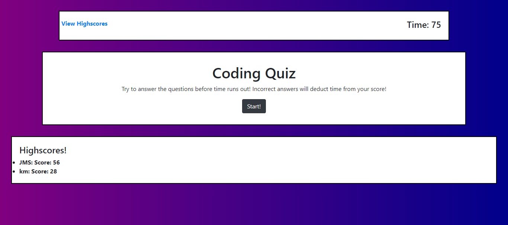
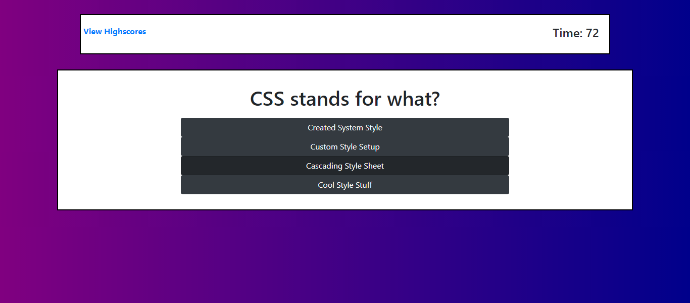
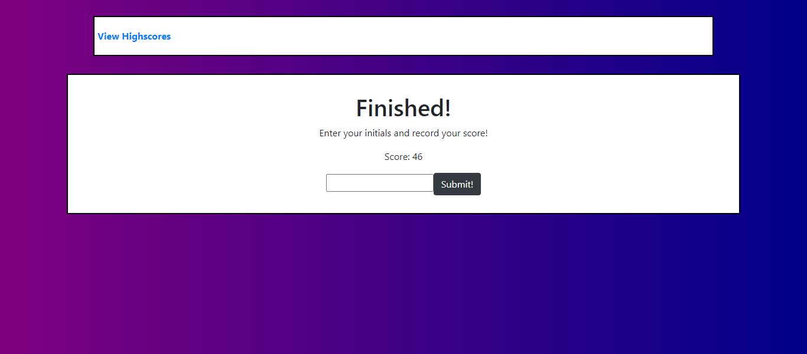
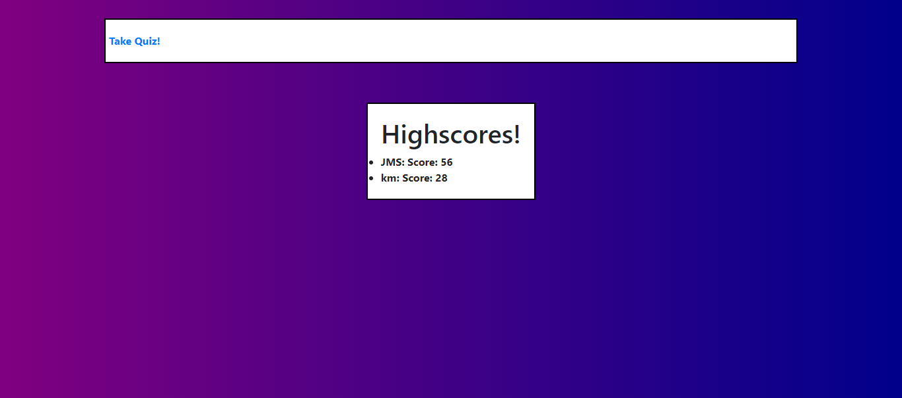

Coding Quiz
created by Jordan Sarvay

The purpose of this app is to allow the user to take a five question quiz on some coding fundamentals utilizing the DOM to display them dynamically.

The landing page draws from local storage to display previously recorded scores.

Upon clicking the start button, the user begins the quiz and a 75 second timer will start.

For every incorrect answer, 10 seconds is deducted from the timer

Upon reaching the end of question five or the timer dropping to zero, the user is directed to the finish 
display where they may record their score to local storage.

A seperate highscore page can be accessed in the top left of the page at any time which will show all highscores from local storage.

If you have any questions about this app, please feel free to reach out to Jordan Sarvay at 804-305-4878 or by email at jordans1@vt.edu.

Deployed link: https://jsarvay.github.io/coding_quiz/

Reference Images:

